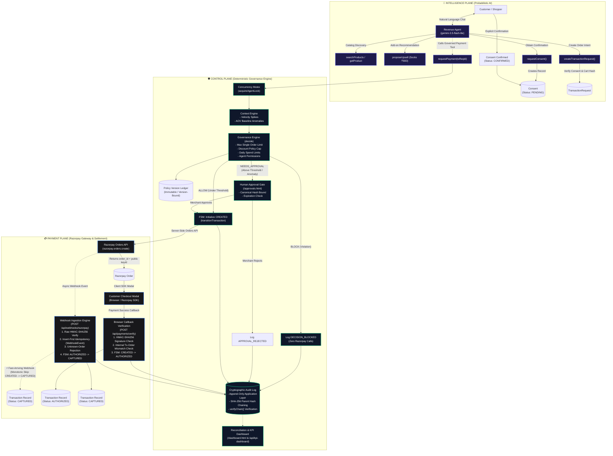

# 🛡️ GuardPay — Control Plane Architecture for Autonomous Agent Commerce

> **A deterministic, multi-plane governance OS that allows probabilistic AI agents to drive retail commerce and upsells without ever touching payment credentials or bypassing merchant risk boundaries.**

[](tests/run-all.ts)
[-indigo?style=flat-square)](scripts/evaluate-scale.ts)
[-cyan?style=flat-square)](scripts/evaluate-scale.ts)
[](scripts/evaluate-scale.ts)
[](src/audit-log.ts)

---

## 📌 Executive Summary & Problem Statement

Autonomous conversational AI agents (LLMs) excel at product discovery, personalized recommendations, and customer negotiation. However, deploying them directly into transactional commerce introduces existential financial and security risks:

1. **Prompt Injection & Social Engineering**: Attackers can manipulate LLMs into inventing discounts, skipping approvals, or ordering goods at unauthorized price points.
2. **Hallucinated Customer Consent**: Models can fabricate verbal customer agreements without explicit, verifiable authorization.
3. **Cart & Price Tampering**: Client-side tampering can alter cart contents between LLM recommendation and payment authorization (Time-of-Check to Time-of-Use / TOCTOU).
4. **Daily Spend Exhaustion & Race Conditions**: Concurrent requests can bypass daily spend ceilings if balance checks and order reservations are not serialized.
5. **Credential Exposure**: Exposing payment gateway API keys or secret keys to LLM runtimes creates direct attack surface for fund draining.

**GuardPay** solves this by establishing a strict **Three-Plane Separation of Concerns**. The LLM operates entirely in an **Intelligence Plane** with zero payment access. All financial rules, consent verifications, order reservations, and settlement webhooks are enforced by a **Deterministic Control Plane** before any request ever reaches the **Payment Plane (Razorpay)**.

---

## 🏛️ Three-Plane System Architecture



---

## 🔒 The 13 Non-Negotiable Governance Invariants

*Note: This table reflects GuardPay's derived and architecturally hardened invariant set implemented across Phases 1–3 based on the original buildathon specifications.*

GuardPay is built around 13 mathematical and architectural invariants enforced at runtime and verified across 16 test suites:

| # | Invariant Principle | Enforcement Mechanism |
| :---: | :--- | :--- |
| **#1** | **Zero Secret Exposure** | Payment secret keys (`RAZORPAY_KEY_SECRET`, `RAZORPAY_WEBHOOK_SECRET`) reside solely in the backend. The Agent and frontend receive only ephemeral public `orderId` and public `keyId`. |
| **#2** | **Zero Client Policy Trust** | Governance thresholds are resolved exclusively from authoritative server DB records. Client-smuggled policy overrides are rejected. |
| **#3** | **Explicit Customer Consent** | Any `CREATE_ORDER` transaction request requires a server-validated `Consent` record in `CONFIRMED` status with a matching SHA-256 cart snapshot hash. |
| **#4** | **Authoritative Pricing & Catalog Integrity** | Cart totals and discounts are recalculated against authoritative server-side catalog prices; client-injected item prices or fabricated coupons are blocked. |
| **#5** | **Hard Floor Precedence** | Hard policy limits (e.g. `maxAmount` cap) strictly supersede context anomaly escalations (`BLOCK` takes precedence over `NEEDS_APPROVAL`). |
| **#6** | **Strict Payment/Order Binding** | A Razorpay payment ID cannot be attached to a different internal order than the one it belongs to; checked via internal DB cross-reference. |
| **#7** | **Monotonic Payment State Machine** | Payment status follows a strict 5-state directed acyclic graph (`CREATED` $\rightarrow$ `CHECKOUT_OPENED` $\rightarrow$ `AUTHORIZED` $\rightarrow$ `CAPTURED`). Terminal states are locked against replay. |
| **#8** | **Deterministic Fast-Webhook Handling** | Fast-arriving `payment.captured` webhooks can jump directly from `CREATED` $\rightarrow$ `CAPTURED`, logging `FAST_WEBHOOK_SKIP_DETECTED` without corrupting state. |
| **#9** | **Cryptographic Snapshot Binding** | Human approvals lock the exact cart contents, total, and policy version under a canonical SHA-256 hash. Any post-escalation modification invalidates the approval. |
| **#10** | **Approval Expiration Safety** | Stale human approvals (>30 minutes) or expired customer consents automatically block checkout execution. |
| **#11** | **Insert-First Webhook Idempotency** | Webhooks are recorded in a dedicated `WebhookEvent` table with unique constraint on `razorpayEventId` prior to processing, rejecting duplicates atomically. |
| **#12** | **Append-Only Hash-Chained Audit Ledger** | Audit logs disallow `UPDATE`/`DELETE` at the application repository layer and compute parent-child `SHA-256(previousHash + eventData)` chains for post-facto tamper detection. |
| **#13** | **Atomic Spend Cap Serialization** | Read-check-write governance boundaries on daily spend limits are serialized via per-agent mutex locks (`acquireAgentLock`) to prevent TOCTOU race condition breaches. |

---

## 📊 Scale Evaluation & Revenue Simulation (Tasks 3.1 & 3.2)

> *Notice: The metrics below are derived from GuardPay's automated 1,000-scenario scale evaluation harness and 100-session paired revenue simulation.*

### 1. Governance Engine Performance (N = 1,000 Synthetic Scenarios)

All 1,000 synthetic transaction requests were evaluated through the live, pure decision engine across 9 operational buckets:

```
Total Scenarios Evaluated           : 1000
Expected-Policy Adherence Metric   : 100.00% (1,000 / 1,000 matching expected)
Verdict Breakdown:
  - ALLOW (Auto-Approved)           : 530 (53.0%)
  - NEEDS_APPROVAL (Human Gated)    : 230 (23.0%)
  - BLOCK (Policy Violations)       : 240 (24.0%)
Policy-Violating Scenarios Blocked  : 240 / 240 (100.0%)
Expected-Safe Scenarios Allowed     : 530 / 530 (100.0%)
Unexpected Decisions Count          : 0
Protected Value Blocked (INR)       : ₹76,36,250
Decision Latency (Pure In-Memory)   : 0.79 µs (avg) | 1.13 µs (p95) | 5.25 µs (p99)
```

#### 9-Bucket Scenario Distribution Breakdown

| Bucket ID | Category & Threat Model | Count | Verdict | Enforcement Rationale | Pass Rate |
| :---: | :--- | :---: | :---: | :--- | :---: |
| **B1** | **Legitimate Auto-Approvals** (Clean ≤ ₹10k orders) | 530 | `ALLOW` | Under policy auto-approval threshold | **100%** |
| **B2** | **Above-Threshold Legitimate** (₹10k–₹20k valid orders) | 150 | `NEEDS_APPROVAL` | Above auto-approve threshold | **100%** |
| **B3a** | **Velocity Anomaly** (Rapid repeated checkout burst) | 40 | `NEEDS_APPROVAL` | Rapid repeated checkout velocity detected | **100%** |
| **B3b** | **AOV Anomaly** (>3x Customer historical baseline) | 40 | `NEEDS_APPROVAL` | Order amount exceeds customer average | **100%** |
| **B4** | **Excessive Amount Limits** (> ₹20,000 hard ceiling) | 100 | `BLOCK` | Exceeds absolute agent limit (Hard precedence) | **100%** |
| **B5** | **Excessive / Fabricated Discounts** (>15% coupons) | 50 | `BLOCK` | Discount percent exceeds policy limit | **100%** |
| **B6** | **Missing Customer Consent** (Consent bypass attempt) | 40 | `BLOCK` | Customer consent required | **100%** |
| **B7** | **Unauthorized Actions** (REFUND, TRANSFER escalation) | 20 | `BLOCK` | Action not permitted for this agent | **100%** |
| **B8** | **Daily Spend Cap Breaches** (Cumulative > ₹100k) | 10 | `BLOCK` | Daily value cap exceeded | **100%** |
| **B9** | **Smuggled Policy Injection** (Client fake maxAmount) | 20 | `BLOCK` | Exceeds absolute agent limit (Authoritative DB policy enforced) | **100%** |

---

### 2. Retail Revenue Uplift Simulation (N = 100 Customer Sessions)

A paired simulation comparing customer checkouts with and without the autonomous Revenue Agent:

- **Baseline Total GMV**: ₹10,37,500
- **Agent-Assisted Total GMV**: ₹10,59,900
- **Net Revenue Uplift**: **+2.16%** (+₹22,400 incremental GMV)
- **Upsell Conversion Rate**: **28.0%** (28 of 100 sessions converted to ₹800 socks add-on)
- **Average Order Value (AOV)**: ₹10,599 (Agent) vs. ₹10,375 (Baseline)

*Modeling Assumption Note: Revenue simulation models an independent upsell recommendation attach rate with zero interaction effect on base cart size (no cannibalization).*

---

## 🖥️ User Interface Surfaces & Developer Sandboxes

GuardPay provides three distinct browser dashboards and one developer sandbox:

| Interface | URL Path | Primary Purpose |
| :--- | :--- | :--- |
| **Live Conversational Customer Store** | [`/agent.html`](agent.html) | Production-quality live customer demo surface. Features real-time Gemini agent chat, visible tool activity pills, explicit out-of-band consent card with 1-click confirmation, Razorpay modal checkout trigger, and quick demo prompts. |
| **Reconciliation & Business KPI Dashboard** | [`/dashboard.html`](dashboard.html) | High-level executive overview combining business revenue uplift, AOV gains, 1,000-scenario governance adherence, verdict distribution bars, and 9-bucket breakdown. |
| **Merchant Human Approval Gate** | [`/approvals.html`](approvals.html) | Live polling UI for high-value orders and behavioral anomaly escalations with snapshot verification, risk tags, and 1-click Approve / Reject. |
| **Cryptographic Audit Trail Explorer** | [`/audit-trail.html`](audit-trail.html) | Real-time immutable event log display with actor tags (`agent`, `human`, `system`), event badges, collapsible JSON metadata, and search filters. |
| **Developer Checkout Sandbox** | [`/test-checkout.html`](test-checkout.html) | **Developer Testing Sandbox Only** (built in Task 1.3 to verify Razorpay modal SDK integration; not a consumer-facing storefront). Uses only the public `keyId` with zero secrets. |

---

## 🧪 Comprehensive Test Matrix (17 Consolidated Suites)

The entire system is continuously validated through a master consolidated test runner executing all 17 test suites in <12 seconds:

```bash
npm test
```

```
================================================================================
                         CONSOLIDATED TEST RESULTS                              
================================================================================

Suite Name                                        Category        Time      Status
------------------------------------------------------------------------------------
Governance Rules & Limits                         unit            1.35s     PASSED
Payment State Machine Pure Logic                  unit            1.28s     PASSED
Context Engine Risk Signals                       unit            0.88s     PASSED
Gateway Tool Integrations & Tampering             unit            0.75s     PASSED
Append-Only Audit Log Enforcement                 unit            0.69s     PASSED
Scale Governance & Revenue Evaluation             unit            0.34s     PASSED
Concurrency & TOCTOU Daily Cap Serialization      unit            0.51s     PASSED
Cryptographic Hash-Chained Audit Log Integrity    unit            0.44s     PASSED
Revenue Agent Conversational Flow                 integration     0.67s     PASSED
State Machine API & Mismatch Rejection            integration     0.69s     PASSED
Webhook Idempotency & Unknown Order Security      integration     0.64s     PASSED
Approval Snapshot Binding & Expiration            integration     0.65s     PASSED
Immutable Policy Versioning & Audit Retention     integration     0.52s     PASSED
Discount Governance & Campaign Boundaries         integration     0.69s     PASSED
End-to-End Payment Lifecycle                      integration     0.86s     PASSED
Prompt-Injection, Tool-Abuse & Boundary Auditing  adversarial     0.68s     PASSED
------------------------------------------------------------------------------------
TOTAL SUITES: 16 | PASSED: 16 | FAILED: 0 | TOTAL TIME: 11.65s
================================================================================
```

---

## 🚀 Quickstart & Setup

### 1. Prerequisites
- **Node.js**: `v20.0.0` or higher
- **Razorpay Test Account**: Key ID, Key Secret, and Webhook Secret
- **Google Gemini API Key**: API key for `gemini-3.5-flash-lite`

### 2. Installation & Configuration
```bash
# Clone the repository
git clone https://github.com/your-org/guardpay.git
cd guardpay

# Install dependencies
npm install

# Copy environment configuration
cp .env.example .env
```

Ensure `.env` contains:
```env
PORT=3000
DATABASE_URL="file:./dev.db"
RAZORPAY_KEY_ID="rzp_test_..."
RAZORPAY_KEY_SECRET="your_razorpay_secret"
RAZORPAY_WEBHOOK_SECRET="your_webhook_secret"
GEMINI_API_KEY="your_gemini_api_key"
MOCK_LLM="true" # Default "true" for quota-free automated testing; set to "false" only for live conversational demo recording
```

### 3. Database Initialization & Schema Push
```bash
npx prisma db push
npx prisma generate
```

### 4. Running the Development Server & Tunnel
```bash
# Start API & Dashboard Server
npm run dev

# Expose Webhook Endpoint via ngrok (in separate terminal)
ngrok http 3000
```

### 5. Running Automated Benchmarks & Tests
```bash
# Run all 16 consolidated test suites (default MOCK_LLM=true for quota-free speed)
npm test

# Run the 1,000-scenario scale governance & revenue evaluation harness
npx tsx scripts/evaluate-scale.ts
```

---

## ⚖️ License

MIT License &copy; 2026 GuardPay Authors. Built for Autonomous Agent Financial Safety.
