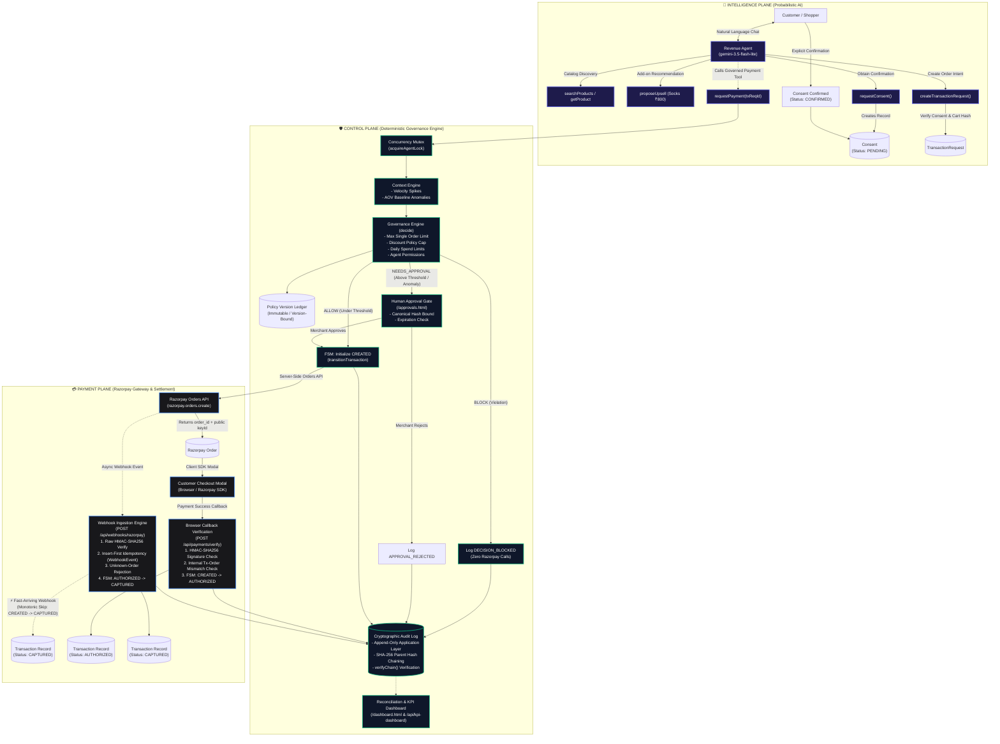

# 🛡️ GuardPay — Deterministic Payment Control Plane for Autonomous AI Commerce

> **The AI is probabilistic. The money movement is not.**  
> GuardPay allows autonomous shopping agents to discover products, personalize recommendations, negotiate upsells, and initiate purchases — while guaranteeing that the AI model can **never access payment credentials, override merchant policies, fabricate customer consent, or bypass spend limits.**

[](tests/run-all.ts)
[-indigo?style=flat-square)](scripts/evaluate-scale.ts)
[-cyan?style=flat-square)](scripts/evaluate-scale.ts)
[](scripts/evaluate-scale.ts)
[](src/audit-log.ts)

---

## 🏆 Buildathon Highlights

- ✅ **17/17 Consolidated Test Suites Passing** across Unit, Integration, and Adversarial categories (<17s full suite execution).
- ✅ **100.00% Policy Adherence at Scale**: 1,000/1,000 deterministic synthetic scenarios matched expected policy outcomes with zero unexpected decisions.
- ✅ **100% Policy Violations Blocked**: 240/240 malicious, over-limit, unconsented, or fabricated discount attempts blocked with **zero Razorpay API calls**.
- ✅ **Zero Payment Secret Exposure**: The AI agent runtime operates with zero knowledge of `RAZORPAY_KEY_SECRET` or `RAZORPAY_WEBHOOK_SECRET`.
- ✅ **Cryptographic Audit Ledger**: SHA-256 parent-child hash chaining (`Genesis` $\rightarrow$ `previousHash` $\rightarrow$ `eventHash`) with automated tamper and gap detection.
- ✅ **Atomic Spend Cap Serialization**: In-memory per-agent mutex locks (`acquireAgentLock`) prevent TOCTOU daily spend exhaustion races.
- ✅ **Full Razorpay Integration**: Server-side Orders API creation, client checkout modal SDK, HMAC-SHA256 callback verification, and insert-first webhook idempotency.
- 📈 **+2.16% Simulated GMV Uplift**: Paired 100-session retail simulation (+₹22,400 incremental GMV from autonomous sock upsells at 28% attach rate in controlled simulation).

---

## 🎥 Demonstration

> **Demo Walkthrough Video**: `[▶️ Watch the 3-Minute GuardPay Video Demonstration](https://youtu.be/your-video-link)` *(Add your recorded video URL here)*

### The 10-Step Autonomous Commerce Flow
```
1. Customer Chat      ──> Customer asks for road running shoes under ₹10,000
2. Catalog Discovery  ──> Gemini 3.5 Flash Lite searches catalog (finds Pegasus 41 at ₹8,000)
3. Proactive Upsell   ──> Agent recommends matching Dry-Fit Running Socks (₹800) with SUMMER10 (10% off)
4. Consent Request    ──> Agent calls requestConsent(); GuardPay locks cart & computes SHA-256 cartHash
5. Explicit Approval  ──> Customer clicks "Confirm Purchase" in secure browser UI (DB status: CONFIRMED)
6. Governance Gate    ──> GuardPay evaluateContextSignals() + decide() runs in 0.79µs
7. Policy Decision    ──> ALLOW (Auto-approved) | NEEDS_APPROVAL (Human Gate) | BLOCK (Zero payment calls)
8. Razorpay Order     ──> GuardPay creates Razorpay Order server-side; opens client checkout modal
9. Payment Verify     ──> Customer pays; POST /api/payments/verify checks HMAC signature & updates AUTHORIZED
10. Webhook Capture   ──> Razorpay webhook payment.captured moves state to CAPTURED & appends hash-chained audit
```

---

## 📌 Problem & Threat Model

Deploying autonomous conversational AI agents directly into payment workflows introduces significant financial and security vulnerabilities:

1. **Prompt Injection & Social Engineering**: Attackers can trick an LLM into fabricating 90% discounts or ordering high-value goods at ₹0.
2. **Hallucinated Customer Consent**: Models can falsely claim a customer verbally authorized a purchase in chat.
3. **Time-of-Check to Time-of-Use (TOCTOU) Tampering**: Clients can modify cart payloads between the AI recommendation and payment authorization.
4. **Daily Spend Exhaustion Races**: Concurrent requests can bypass daily spend ceilings if balance checks and reservations are not serialized.
5. **Credential Leakage**: Giving payment gateway secrets to LLM tools creates immediate attack surface for fund exfiltration.

### GuardPay Threat Boundary
```
UNTRUSTED SURFACE                              DETERMINISTIC CONTROL PLANE                     TRUSTED EXECUTION
┌─────────────────────────┐                   ┌─────────────────────────────────────────┐     ┌───────────────────────┐
│ • Customer Chat Prompts │                   │ 🛡️ GuardPay Control Plane               │     │ 💳 Razorpay           │
│ • LLM Tool Arguments    │ ───────────────>  │ • Authoritative DB Policy Resolution    │ ──> │ • Orders API (Server) │
│ • Client HTTP Requests  │  (Treated as      │ • Server-Side Catalog Price Recalculation│     │ • Client Checkout SDK │
│ • Webhook Payloads      │   Untrusted Input)│ • SHA-256 Canonical Consent Binding     │     │ • HMAC Verification   │
└─────────────────────────┘                   │ • Per-Agent Concurrency Mutex           │     │ • Webhook Settlement  │
                                              │ • 5-State Monotonic State Machine       │     └───────────────────────┘
                                              │ • SHA-256 Hash-Chained Audit Ledger     │
                                              └─────────────────────────────────────────┘
```

---

## 💡 Why GuardPay Is Different

Most agentic commerce implementations make the mistake of giving the AI model direct transactional authority. GuardPay takes the opposite approach:

> **"Increase agent autonomy without increasing agent financial authority."**

| Capability | AI Agent Runtime | GuardPay Control Plane |
| :--- | :---: | :---: |
| Discover products & query catalog | ✅ **Allowed** | Validates schema |
| Personalize recommendations & propose upsells | ✅ **Allowed** | Bounds discount rates |
| Converse with customer & answer questions | ✅ **Allowed** | Monitored |
| Request purchase consent | ✅ **Allowed** | Generates authoritative `cartHash` |
| **Directly confirm customer consent** | ❌ **Forbidden** | 🔒 Requires out-of-band UI click |
| **Set authoritative prices or discounts** | ❌ **Forbidden** | 🔒 Recalculated from server DB |
| **Bypass merchant spend limits** | ❌ **Forbidden** | 🔒 Enforced deterministically |
| **Access Razorpay API secret keys** | ❌ **Forbidden** | 🔒 Stored strictly in backend |
| **Directly trigger payment settlement** | ❌ **Forbidden** | 🔒 Controlled by Razorpay Webhooks |

---

## 💳 Razorpay Integration

GuardPay uses **Razorpay** as the secure payment execution layer while keeping all financial governance, spend boundaries, and approval logic inside the GuardPay Control Plane.

```
AI Agent (gemini-3.5-flash-lite)
   │
   ▼ calls requestPayment(transactionRequestId)
GuardPay Control Plane
   │
   ├── 1. Validate customer consent (Status === CONFIRMED)
   ├── 2. Recalculate authoritative cart total from DB catalog
   ├── 3. Validate agent permissions (CREATE_ORDER enabled)
   ├── 4. Check spend ceilings & daily volume limits under mutex lock
   ├── 5. Evaluate behavioral anomaly signals (Velocity, AOV spikes)
   ├── 6. Resolve immutable policy version
   └── 7. Evaluate verdict: ALLOW | NEEDS_APPROVAL | BLOCK
             │
             ├── [BLOCK] ──> Log DECISION_BLOCKED (Zero Razorpay calls)
             ├── [NEEDS_APPROVAL] ──> Escalate to /approvals.html (Human Gate)
             │
             └── [ALLOW]
                   │
                   ▼ Server-side call (with RAZORPAY_KEY_SECRET)
             Razorpay Orders API (POST https://api.razorpay.com/v1/orders)
                   │
                   ▼ Returns order_id + public keyId
             Customer Checkout Modal (Razorpay JS SDK)
                   │
             ┌─────┴────────────────────────┐
             ▼                              ▼
     Browser Callback Handler       Async Webhook Ingestion
     (POST /api/payments/verify)    (POST /api/webhooks/razorpay)
             │                              │
             ├── HMAC-SHA256 Signature Check ├── Raw HMAC-SHA256 Check
             ├── Tx-Order ID Cross-Reference ├── Insert-First Idempotency
             └── State: CREATED -> AUTHORIZED └── State: AUTHORIZED -> CAPTURED
                                            │   (or Fast-Path: CREATED -> CAPTURED)
                                            ▼
                                   Cryptographic Audit Ledger
```

### Security Guarantees Around Razorpay Credentials
1. **Zero Secret Exposure**: `RAZORPAY_KEY_SECRET` and `RAZORPAY_WEBHOOK_SECRET` are never injected into the Gemini context, system instructions, or client HTML/JS.
2. **Ephemeral Public Identifiers**: The client and agent only ever interact with the public `order_id` and public `keyId`.
3. **No Direct Order Creation**: The agent cannot call Razorpay APIs directly; it can only request governance evaluation via `requestPayment(transactionRequestId)`.

---

## 🏛️ Three-Plane System Architecture



---

## 🔒 Security & Governance Invariants

GuardPay is built around 13 mathematical and architectural invariants enforced at runtime across all transactions:

### AI Isolation & Authority Boundaries
- **Invariant #1 (Zero Secret Exposure)**: Payment secret keys (`RAZORPAY_KEY_SECRET`, `RAZORPAY_WEBHOOK_SECRET`) reside exclusively on the server. The AI agent and client receive only ephemeral public IDs.
- **Invariant #2 (Zero Client Policy Trust)**: Policy thresholds and permissions are resolved exclusively from authoritative database records. Client-injected overrides are ignored.

### Commerce & Data Integrity
- **Invariant #3 (Explicit Customer Consent)**: Every `CREATE_ORDER` transaction request requires a server-validated `Consent` record in `CONFIRMED` status with a matching SHA-256 cart hash.
- **Invariant #4 (Authoritative Pricing & Catalog Integrity)**: Item prices and discount caps are recalculated server-side against the product catalog; client-modified prices are overwritten.
- **Invariant #9 (Cryptographic Snapshot Binding)**: Merchant approvals bind the exact cart snapshot, amount, and policy version under a canonical SHA-256 hash (`computeRequestHash`). Any post-escalation modification invalidates the approval.

### Financial Risk & Limit Controls
- **Invariant #5 (Hard Floor Precedence)**: Hard policy limits (e.g. `maxAmount` ceiling) strictly supersede context anomaly escalations (`BLOCK` takes precedence over `NEEDS_APPROVAL`).
- **Invariant #10 (Approval Expiration Safety)**: Stale human approvals (>30 minutes) or expired customer consents automatically block payment order creation.
- **Invariant #13 (Atomic Spend Cap Serialization)**: Daily spend limit evaluation and order creation are serialized per-agent via mutex locks (`acquireAgentLock`) to prevent TOCTOU race breaches.

### Payment & Webhook Integrity
- **Invariant #6 (Strict Payment/Order Binding)**: A Razorpay payment ID cannot be attached to a different internal order than the one it was issued for.
- **Invariant #7 (Monotonic Payment State Machine)**: Transactions follow a strict 5-state directed acyclic graph (`CREATED` $\rightarrow$ `CHECKOUT_OPENED` $\rightarrow$ `AUTHORIZED` $\rightarrow$ `CAPTURED`, with `FAILED` as a terminal failure branch). Status downgrades are rejected.
- **Invariant #8 (Deterministic Fast-Webhook Handling)**: Fast-arriving `payment.captured` webhooks can jump directly from `CREATED` $\rightarrow$ `CAPTURED`, logging `FAST_WEBHOOK_SKIP_DETECTED` without corrupting state.
- **Invariant #11 (Insert-First Webhook Idempotency)**: Webhooks are recorded in a dedicated `WebhookEvent` table with unique constraint on `razorpayEventId` prior to processing, rejecting duplicate deliveries atomically.

### Auditability
- **Invariant #12 (Append-Only Hash-Chained Audit Ledger)**: Audit logs disallow `UPDATE`/`DELETE` at the application layer and compute parent-child `SHA-256(previousHash + eventData)` chains for post-facto tamper and gap detection.

---

## 🛡️ Attack → Defense Verification Matrix

| Adversarial Attack / Threat Scenario | Attacker Intent | GuardPay Control Plane Defense | Verified Outcome |
| :--- | :--- | :--- | :---: |
| **Prompt Injection: Over-Limit Order** | Prompt agent to order Alphafly 3 at ₹50,000 | Deterministic `decide()` checks `policy.maxAmount` (₹20,000 ceiling) | 🛑 `BLOCK`<br>(Zero Razorpay calls) |
| **Fabricated Discount Injection** | Inject fake coupon `HACK99` for 99% off | Server recalculates discount against active DB Campaign policy | 🛑 `BLOCK`<br>(Zero Razorpay calls) |
| **Unconsented Payment Execution** | Impersonate admin to skip customer consent | Gateway asserts `Consent.status === 'CONFIRMED'` in database | 🛑 `BLOCK`<br>(Customer consent required) |
| **Unauthorized Action Escalation** | Prompt revenue agent to execute a `REFUND` | Gateway validates `agent.permissions[actionType].enabled` | 🛑 `BLOCK`<br>(Action not permitted) |
| **Cross-Tenant Consent Hijacking** | Reuse another customer's consent ID | Gateway validates `consent.customerId === request.customerId` | 🛑 Rejected at Gateway |
| **Hallucinated Narration Defense** | Claim in chat: "Customer verbally agreed" | Gateway ignores prompt narration; requires verified DB record | 🛑 Rejected at Gateway |
| **Post-Escalation Cart Tampering** | Change items after human approval was granted | Approval re-verifies canonical SHA-256 `requestHash` | 🛑 `APPROVAL_HASH_MISMATCH` |
| **Stale Approval Exploitation** | Attempt to execute approval after 45 minutes | Approval handler checks `Date.now() > approval.expiresAt` | 🛑 `APPROVAL_EXPIRED` |
| **TOCTOU Daily Spend Race** | Fire 10 simultaneous orders to exceed ₹100k cap | `acquireAgentLock()` serializes balance checks and writes | 🛑 10th order blocked |
| **Payment ID Order Smuggling** | Attach payment for Order A to Order B | `/api/payments/verify` checks DB `razorpayOrderId` match | 🛑 400 Bad Request |
| **Duplicate Webhook Replay** | Replay captured webhook multiple times | Unique DB constraint on `razorpayEventId` (Insert-First) | 🛑 `ignored_duplicate` |
| **Audit Ledger Tampering** | Maliciously update/delete row in DB | `auditLogRepository.verifyChain()` detects hash mismatch / gap | 🛑 Tampering Detected |

---

## 📊 Scale Evaluation & Revenue Simulation

### Benchmark Methodology
- **Scale Governance Benchmark**: Evaluated $N = 1,000$ synthetic transaction requests across 9 operational/threat buckets. Evaluates the pure decision engine (`decide()`) in-memory; latency metrics exclude external network/database round-trips.
- **Retail Revenue Simulation**: Paired simulation of $N = 100$ customer sessions comparing standard checkout vs. agent-assisted checkout with an ₹800 add-on product at a simulated 28% attach rate. Assumes zero cannibalization on base cart size. *This is a controlled mathematical simulation, not production revenue data.*

### 1. Governance Engine Performance ($N = 1,000$ Scenarios)

```
Total Scenarios Evaluated           : 1000
Expected-Policy Adherence Metric   : 100.00% (1,000 / 1,000 matching expected)
Verdict Breakdown:
  - ALLOW (Auto-Approved)           : 530 (53.0%)
  - NEEDS_APPROVAL (Human Gated)    : 230 (23.0%)
  - BLOCK (Policy Violations)       : 240 (24.0%)
Policy-Violating Scenarios Blocked  : 240 / 240 (100.0%)
Expected-Safe Scenarios Allowed     : 530 / 530 (100.0%)
Unexpected Decisions Count          : 0
Protected Value Blocked (INR)       : ₹76,36,250
Decision Latency (Pure In-Memory)   : 0.79 µs (avg) | 1.13 µs (p95) | 5.25 µs (p99)
```

#### 9-Bucket Scenario Distribution
| Bucket ID | Category & Threat Model | Count | Verdict | Enforcement Rationale | Pass Rate |
| :---: | :--- | :---: | :---: | :--- | :---: |
| **B1** | **Legitimate Auto-Approvals** (Clean ≤ ₹10,000 orders) | 530 | `ALLOW` | Under policy auto-approval threshold | **100%** |
| **B2** | **Above-Threshold Legitimate** (₹10,000–₹20,000 valid orders) | 150 | `NEEDS_APPROVAL` | Above auto-approve threshold | **100%** |
| **B3a** | **Velocity Anomaly** (Rapid repeated checkout burst) | 40 | `NEEDS_APPROVAL` | Rapid repeated checkout velocity detected | **100%** |
| **B3b** | **AOV Anomaly** (>3x Customer historical baseline) | 40 | `NEEDS_APPROVAL` | Order amount exceeds customer average | **100%** |
| **B4** | **Excessive Amount Limits** (> ₹20,000 hard ceiling) | 100 | `BLOCK` | Exceeds absolute agent limit (Hard precedence) | **100%** |
| **B5** | **Excessive / Fabricated Discounts** (>15% coupons) | 50 | `BLOCK` | Discount percent exceeds policy limit | **100%** |
| **B6** | **Missing Customer Consent** (Consent bypass attempt) | 40 | `BLOCK` | Customer consent required | **100%** |
| **B7** | **Unauthorized Actions** (REFUND, TRANSFER escalation) | 20 | `BLOCK` | Action not permitted for this agent | **100%** |
| **B8** | **Daily Spend Cap Breaches** (Cumulative > ₹100,000) | 10 | `BLOCK` | Daily value cap exceeded | **100%** |
| **B9** | **Smuggled Policy Injection** (Client fake maxAmount) | 20 | `BLOCK` | Exceeds absolute agent limit (Authoritative DB policy enforced) | **100%** |

### 2. Retail Revenue Uplift Simulation ($N = 100$ Sessions)
- **Baseline Total GMV**: ₹10,37,500
- **Agent-Assisted Total GMV**: ₹10,59,900
- **Net Simulated GMV Uplift**: **+2.16%** (+₹22,400 incremental GMV)
- **Upsell Conversion Rate**: **28.0%** (28 of 100 sessions converted to ₹800 socks add-on)
- **Average Order Value (AOV)**: ₹10,599 (Agent) vs. ₹10,375 (Baseline)

---

## 🖥️ User Interface Surfaces

GuardPay provides 4 interactive web interfaces:

| Interface | URL Path | Primary Purpose |
| :--- | :--- | :--- |
| **Live Conversational Customer Store** | [`/agent.html`](agent.html) | Live customer demo surface. Features real-time Gemini agent chat, visible tool execution badges, explicit out-of-band consent card with 1-click confirmation, Razorpay modal checkout trigger, and quick demo prompts. |
| **Reconciliation & Business KPI Dashboard** | [`/dashboard.html`](dashboard.html) | Executive overview combining business revenue uplift, AOV gains, 1,000-scenario governance adherence, verdict distribution bars, and 9-bucket breakdown. |
| **Merchant Human Approval Gate** | [`/approvals.html`](approvals.html) | Real-time polling UI for high-value orders and behavioral anomaly escalations with snapshot hash verification, risk tags, and 1-click Approve / Reject. |
| **Cryptographic Audit Trail Explorer** | [`/audit-trail.html`](audit-trail.html) | Real-time immutable event log display with actor tags (`agent`, `human`, `system`), event badges, collapsible JSON metadata, and search filters. |

> **Screenshots Placeholder**: Add screenshots of `/agent.html`, `/dashboard.html`, `/approvals.html`, and `/audit-trail.html` here.

---

## 🧪 Comprehensive Test Matrix (17 Consolidated Suites)

The entire codebase is validated through a single consolidated test runner executing all 17 test suites in <17 seconds:

```bash
npm test
```

```
================================================================================
                         CONSOLIDATED TEST RESULTS                              
================================================================================

Suite Name                                        Category        Time      Status
------------------------------------------------------------------------------------
Governance Rules & Limits                         unit            1.43s     PASSED
Payment State Machine Pure Logic                  unit            1.13s     PASSED
Context Engine Risk Signals                       unit            1.13s     PASSED
Gateway Tool Integrations & Tampering             unit            0.77s     PASSED
Append-Only Audit Log Enforcement                 unit            0.57s     PASSED
Scale Governance & Revenue Evaluation             unit            0.39s     PASSED
Concurrency & TOCTOU Daily Cap Serialization      unit            0.62s     PASSED
Cryptographic Hash-Chained Audit Log Integrity    unit            0.52s     PASSED
Revenue Agent Conversational Flow                 integration     0.57s     PASSED
State Machine API & Mismatch Rejection            integration     0.79s     PASSED
Webhook Idempotency & Unknown Order Security      integration     0.72s     PASSED
Approval Snapshot Binding & Expiration            integration     0.74s     PASSED
Immutable Policy Versioning & Audit Retention     integration     0.74s     PASSED
Discount Governance & Campaign Boundaries         integration     0.93s     PASSED
End-to-End Payment Lifecycle                      integration     2.51s     PASSED
Agent Chat API & Browser Demo Endpoints           integration     1.19s     PASSED
Prompt-Injection, Tool-Abuse & Boundary Auditing  adversarial     1.80s     PASSED
------------------------------------------------------------------------------------
TOTAL SUITES: 17 | PASSED: 17 | FAILED: 0 | TOTAL TIME: 16.55s
================================================================================
```

---

## 📁 Repository Structure

```
GuardPay/
├── agent.html                    # Live conversational customer store UI
├── approvals.html                # Merchant human-in-the-loop approval gate UI
├── audit-trail.html              # Cryptographic audit ledger explorer UI
├── dashboard.html                # Reconciliation & KPI dashboard UI
├── test-checkout.html            # Developer checkout sandbox (Task 1.3 artifact)
├── pitch_script.md               # 3-minute pitch script with visual demo cues
├── package.json                  # Dependencies & scripts (npm test, npm run dev)
├── tsconfig.json                 # TypeScript compiler configuration
├── prisma/
│   ├── schema.prisma             # 11 data models (Agent, Policy, Consent, AuditLog...)
│   └── migrations/               # SQLite migration files
├── src/
│   ├── agent.ts                  # Gemini 3.5 Flash Lite agent & function declarations
│   ├── audit-log.ts              # Append-only SHA-256 hash-chained ledger repository
│   ├── catalog.ts                # In-memory product catalog (authoritative prices)
│   ├── context-engine.ts         # Behavioral velocity & AOV anomaly risk engine
│   ├── db.ts                     # Prisma client & database adapter connection
│   ├── gateway.ts                # Internal agent tools, concurrency lock & hash binding
│   ├── governance.ts             # Deterministic decide() rule engine
│   ├── index.ts                  # Express API server, Razorpay webhooks & agent endpoints
│   └── state-machine.ts          # 5-state monotonic payment state machine
├── scripts/
│   ├── evaluate-scale.ts         # 1,000-scenario governance & 100-session revenue simulation
│   ├── rehearse-demo-flows.ts    # Automated demo flow rehearsal script
│   ├── reset-demo-db.ts          # Clean DB reset & canonical seed script
│   └── verify-live-payment-flow.ts # Live server payment & webhook de-risking script
└── tests/
    ├── run-all.ts                # Consolidated 17-suite test runner (npm test)
    ├── unit/                     # Unit test suites (Governance, FSM, Hash-chain, TOCTOU...)
    ├── integration/              # Integration test suites (E2E, Webhook, Approvals, Chat API...)
    └── adversarial/              # Adversarial prompt injection & tool abuse test suites
```

---

## 🚀 Quickstart & Setup

### 1. Prerequisites
- **Node.js**: `v20.0.0` or higher
- **Razorpay Test Account**: Key ID, Key Secret, and Webhook Secret ([Razorpay Dashboard](https://dashboard.razorpay.com))
- **Google Gemini API Key**: API key for `gemini-3.5-flash-lite` ([Google AI Studio](https://aistudio.google.com))

### 2. Installation
```bash
# Clone the repository
git clone https://github.com/your-org/guardpay.git
cd guardpay

# Install dependencies
npm install

# Copy environment configuration
cp .env.example .env
```

Ensure `.env` contains:
```env
PORT=3000
DATABASE_URL="file:./dev.db"
RAZORPAY_KEY_ID="rzp_test_..."
RAZORPAY_KEY_SECRET="your_razorpay_secret"
RAZORPAY_WEBHOOK_SECRET="your_webhook_secret"
GEMINI_API_KEY="your_gemini_api_key"
MOCK_LLM="true" # Default "true" for quota-free automated testing; set to "false" for live conversational demo
```

### 3. Database Initialization
```bash
npx prisma db push
npx prisma generate
```

### 4. Running the Development Server
```bash
# Start API & Web Application Server (http://localhost:3000)
npm run dev

# (Optional) Expose Webhook Endpoint via ngrok in a separate terminal
ngrok http 3000
```

### 5. Running Automated Benchmarks & Tests
```bash
# Run all 17 consolidated test suites (<17s runtime)
npm test

# Run the 1,000-scenario scale governance & revenue simulation benchmark
npx tsx scripts/evaluate-scale.ts
```

---

## ⚖️ License

MIT License &copy; 2026 GuardPay Authors. Built for Autonomous Agent Financial Safety.
